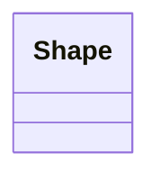
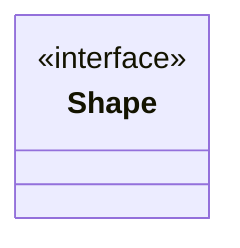
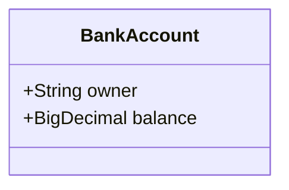
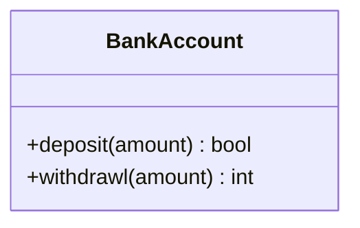
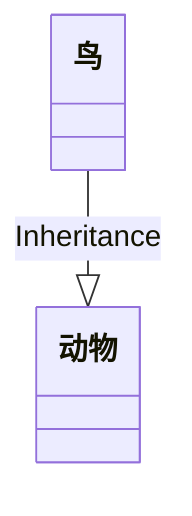
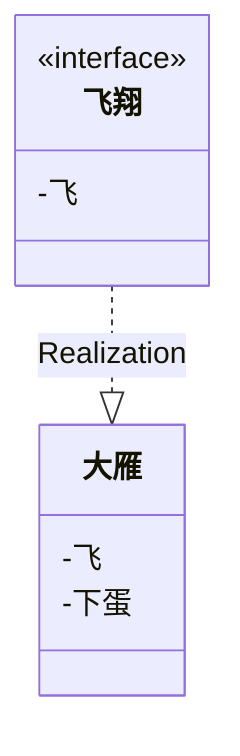
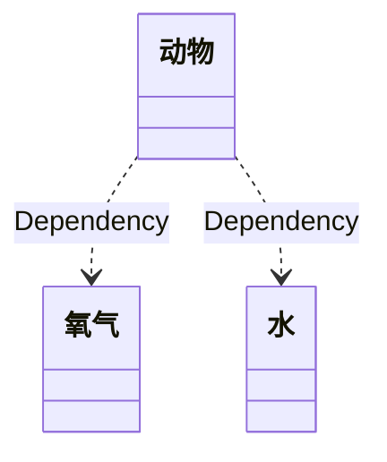
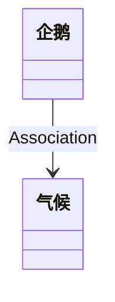
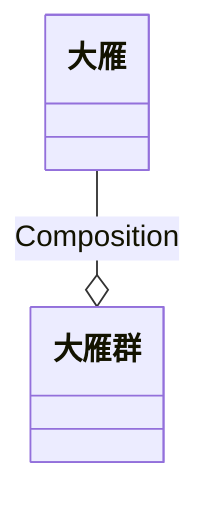
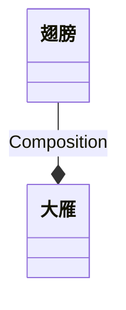

## 类图
用来说明类类之间的静态关系和类的结构

### 类的表示
类实体表示


协议表示


### 类属性的表示



### 类的方法的表示



### 访问权限的表示
```
+ Public      			//公共
- Private	  			//私有
# Protected   			 //保护
~ Package/Internal     //包
```


### 类与类之间关系的表示

Type |	Description
-- | --
<\|-- |	Inheritance(继承)
\*--	| Compositio(组合)
o-- |	Aggregation(聚合)
--> |	Association（关联）
..> |	Dependency（依赖）
..\|>	| Realization（实现）

#### 继承
表示一个类（称为子类、子接口）继承另外的一个类（称为父类、父接口）的功能，并可以增加它自己的新功能的能力。
继承使用空心三角形+实线表示。



#### 实现
表示一个class类实现interface接口（可以是多个）的功能。
使用空心三角形+虚线表示




#### 依赖
表示对于两个相对独立的对象，当一个对象负责构造另一个对象的实例，或者依赖另一个对象的服务。
依赖关系用虚线箭头表示。




#### 关联
表示对于两个相对独立的对象，当一个对象的实例与另一个对象的一些特定实例存在固定的对应关系。
关联关系用实线箭头表示



#### 聚合
表示一种弱的‘拥有’关系，即has-a的关系，体现的是A对象可以包含B对象，但B对象不是A对象的一部分。 两个对象具有各自的生命周期。
聚合关系用空心的菱形+实线箭头表示




#### 组合
表示一种强的‘拥有’关系，是一种contains-a的关系，体现了严格的部分和整体关系，部分和整体的生命周期一样。
组合关系用实心的菱形+实线箭头表示

