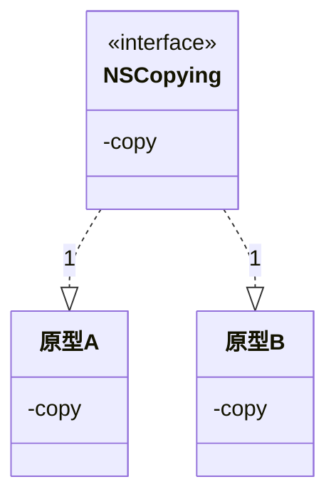
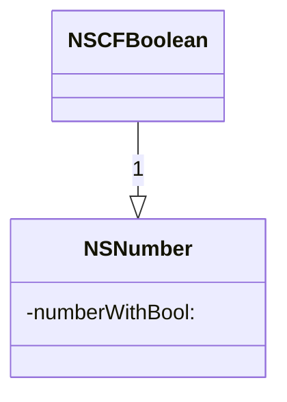

# 简介
设计模式是为特定场景下的问题而定制的解决方案

特定场景指问题所在的重复出现的场景  
问题指特定环境下想要达成的目标

好处：
如果在设计中使用了设计模式，将来就更易于复用与扩展，更易于变更

## 表示
了解[[对象建模技术]]

# 设计模式的基本原则

# 常见的设计模式

### 单例模式

### 原型模式
> 使用原型实例指定创建对象的种类，并通过复制这个原型对象创建新的对象

#### Cocoa Touch
NSCopying协议及其方法

### 工厂模式
也称`虚构造器`
定义创建对象的接口，让子类决定实例化哪一个类，工厂方法使得一个类的实例话延迟到其子类。

